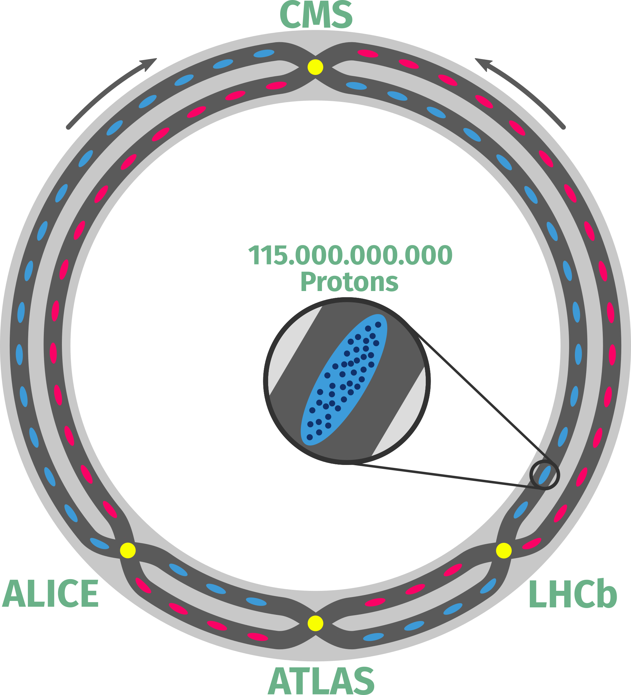

# Simple sketch of the LHC  

### What is this? 

For my Ph.D. defense I wanted a simple enough sketch of what is going on inside the LHC, but was frustrated that I couldn't find one!
Soo... I decided to procrastinate away and ended up making one myself.     

I'm sharing this here in case someone out there thinks this is useful, and doesn't have the time to procrastinate by creating their own version.
So feel free to simply use the [png file](LHC_Sketch.png) or start with the [original  svg](LHC_Sketch.svg) to modify this sketch to your liking. 

### What's shown:

- Two beam pipes (**dark grey**) in which proton bunches (**red & blue dots**) are circulated in opposite direction.
- Each proton bunch contains ~ **115.000.000.000** protons.
- The 4 locations where the beam pipes cross and proton bunches are collided (**yellow dots**).
- Location of the four main LHC experiements: **ATLAS**, **ALICE**, **CMS**, and **LHCb**.

